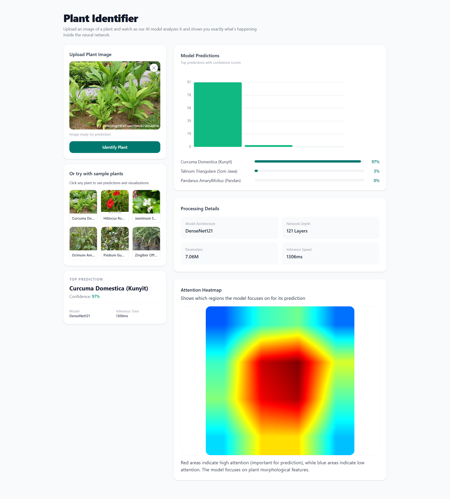
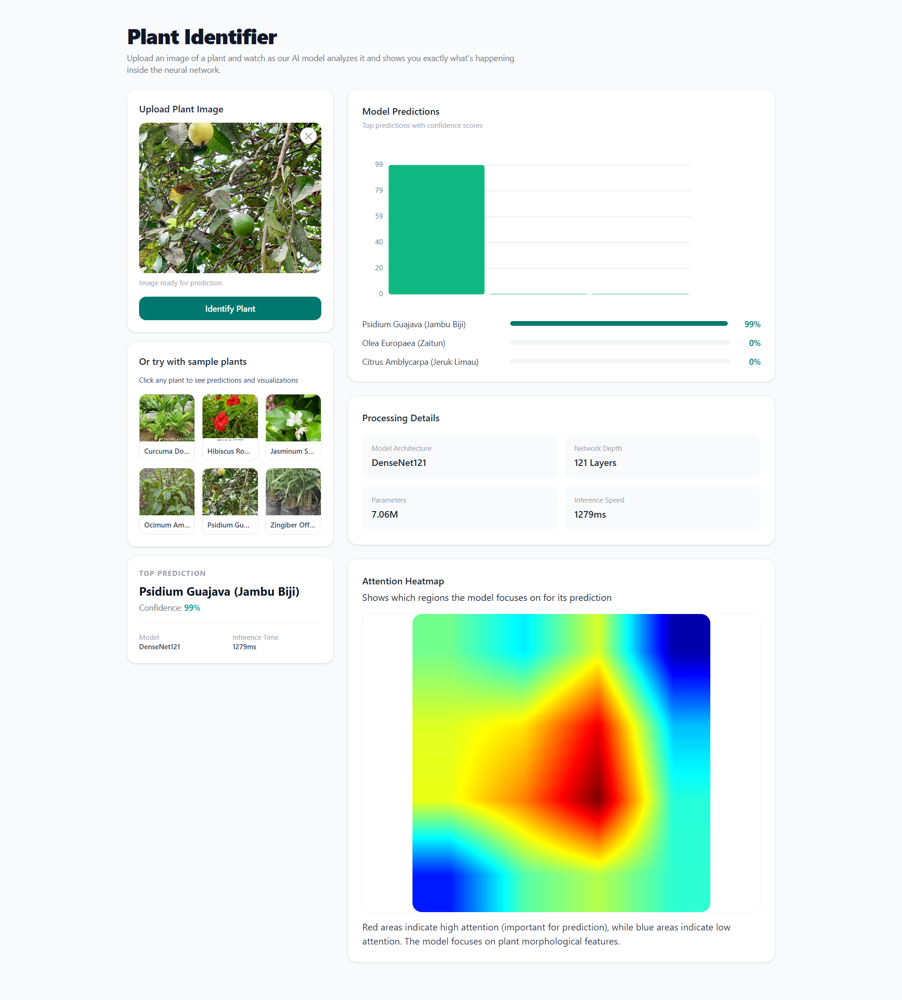

# IndoHurb

A plant species recognition and insights platform combining fast API backend, deep learning model inference, and a modern frontend.

<!-- ## 🚀 Quick Start

1. Backend
   - `cd API`
   - `pip install -r requirements.txt`
   - `uvicorn app:app --reload`

2. Frontend
   - `cd frontend`
   - `npm install`
   - `npm run dev`

3. Data processing & model training are in `Data_operations` and `src/indoherb`. -->

## 📁 Project Structure

- `API/` - FastAPI routes, model inference, Grad-CAM utilities.
- `Data_operations/` - loader, split, and transformation scripts.
- `frontend/` - web UI (Vite/React).
- `Results/` - outputs, demo screenshots.

## 🖼️ Results (side-by-side)

<table>
  <tr>
    <td></td>
    <td></td>
  </tr>
</table>

## 🧩 Usage

- Upload leaf images in UI to predict plant type.
- See Grad-CAM heatmap overlays in `Results/` for explainability.

<!-- ## 📌 Notes

- Adjust model paths in `API/model.py` as needed (e.g., `models/resnet34_best.pth`).
- `Results/Web1.png` and `Results/Web2.png` are included and shown above. -->
